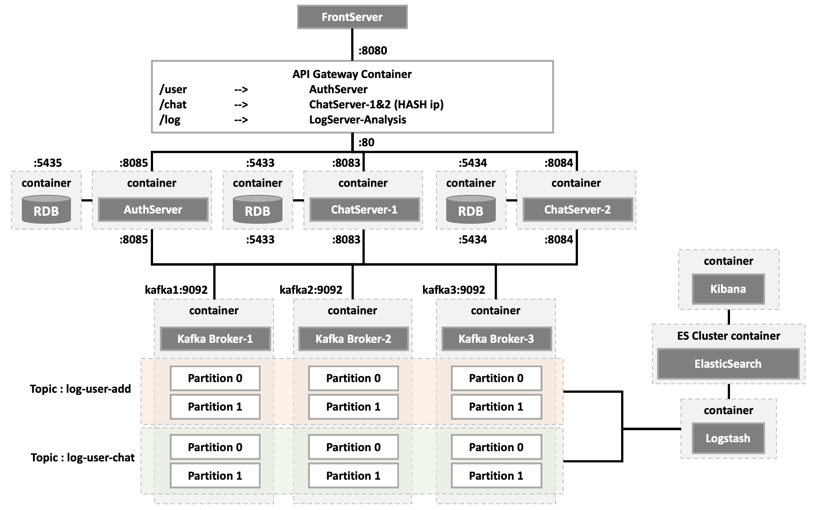
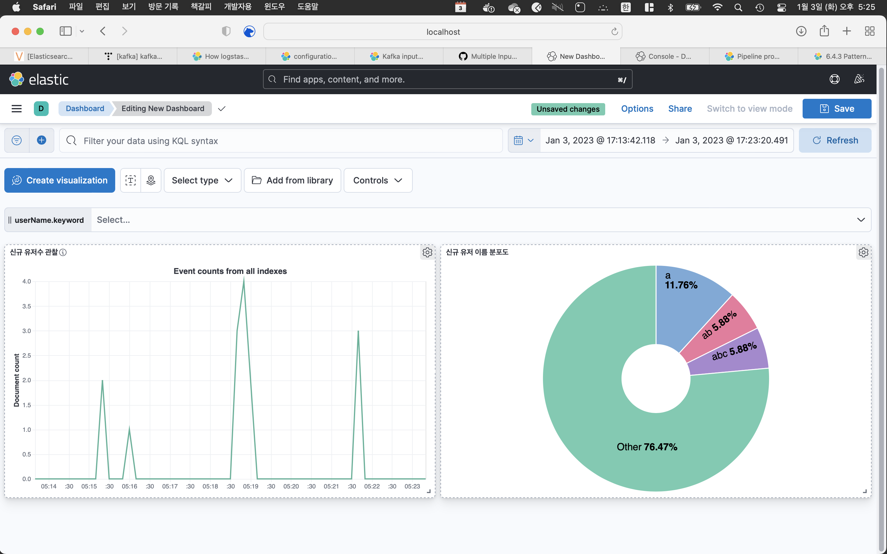
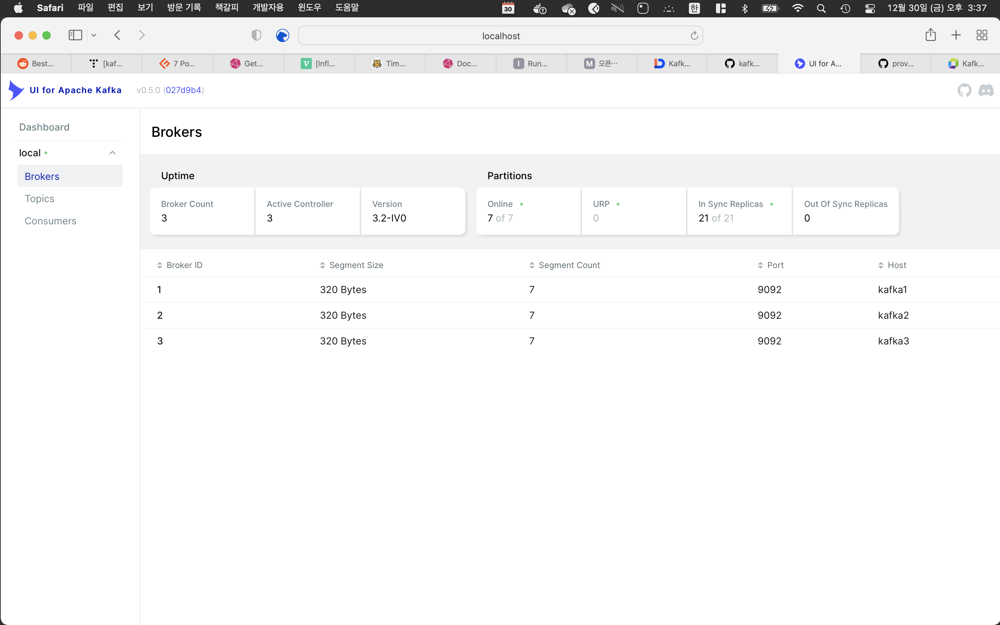
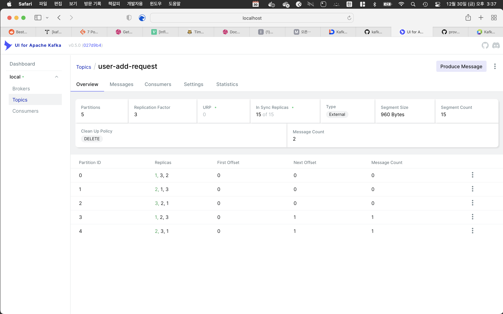
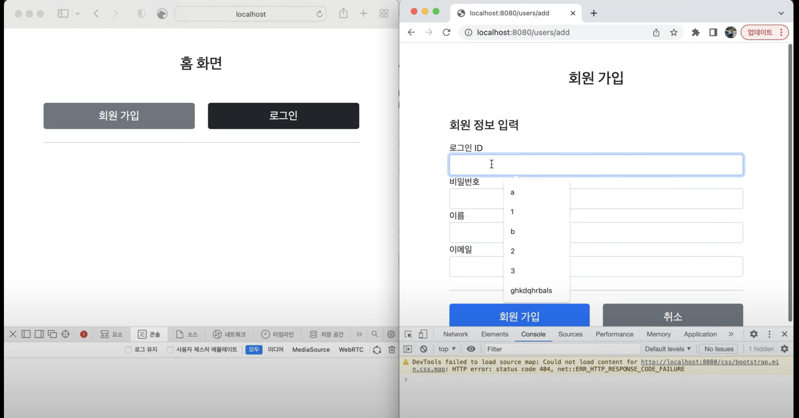
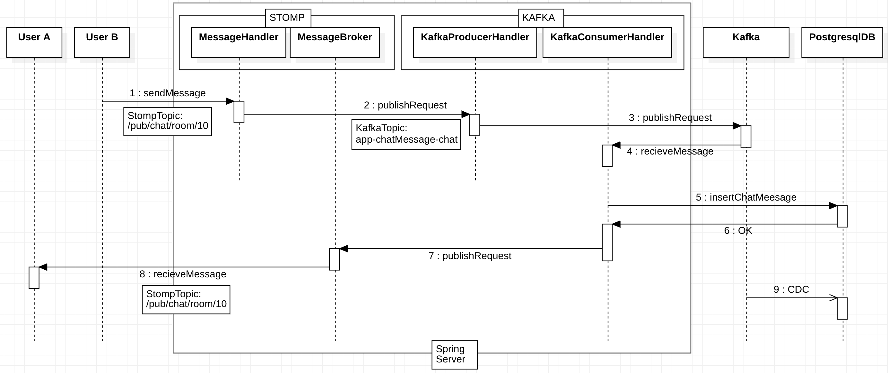

# Spring Java 채팅서버구현
## Versions

| Version                                                                 | Last Update | Skills                                                                                                  | 
|-------------------------------------------------------------------------|-------------|---------------------------------------------------------------------------------------------------------|
| **[v1](https://github.com/ghkdqhrbals/spring-chatting-server/tree/v1)** | 2022.12.14  | WebSocket, Kafka, Spring-Data-Jpa, Thymeleaf, Interceptor, etc.                                         |
| **[v2](https://github.com/ghkdqhrbals/spring-chatting-server/tree/v2)** | 2023.01.03  | ElasticSearch, Logstash, Kibana, WebSocket, Kafka, Spring-Data-Jpa, Thymeleaf, Interceptor, etc. |

# v2
### Running Chat Backend Server with Docker

1. 루트 디렉토리에서 `docker-compose -f docker-compose.yml up -d` 실행
2. 관찰 후, `docker-compose -f docker-elk/docker-compose-es.yml up -d` 실행
3. http://localhost:5601 을 통해 kibana 접속 후, `new-user`, `chat` 인덱스 생성
4. 이후 WAS restapi 통신

    > 추가적으로 `docker-compose-monitor.yaml`을 통해 http://localhost:8989 로 kafka 내 토픽 및 할당브로커 관찰 가능

### Update[v2.0.0]
#### Architecture

#### Visualized Kafka Traffics and others
* Kibana
  
* UI for Kafka
  
  
1. 모노서버 분리
   * 유저인증서버 + 채팅서버
2. Kafka 멀티 브로커 설정
3. ElasticSearch 연동
4. Logstash input filter 설정
5. Kibana 연동 및 시각화 설정
6. Docker container화

    >```
    >CONTAINER ID   IMAGE                                      COMMAND                  CREATED          STATUS          PORTS                                                                                                NAMES
    >c8844bebca0f   docker-elk_logstash                        "/usr/local/bin/dock…"   32 seconds ago   Up 30 seconds   0.0.0.0:5044->5044/tcp, 0.0.0.0:9600->9600/tcp, 0.0.0.0:50000->50000/tcp, 0.0.0.0:50000->50000/udp   docker-elk_logstash_1
    >10932c3ca0cf   docker-elk_kibana                          "/bin/tini -- /usr/l…"   32 seconds ago   Up 31 seconds   0.0.0.0:5601->5601/tcp                                                                               docker-elk_kibana_1
    >ecc046260f13   docker-elk_elasticsearch                   "/bin/tini -- /usr/l…"   33 seconds ago   Up 32 seconds   0.0.0.0:9200->9200/tcp, 0.0.0.0:9300->9300/tcp                                                       docker-elk_elasticsearch_1
    >4f85aff682ba   spring-chatting-server_nginx               "/docker-entrypoint.…"   54 minutes ago   Up 54 minutes   0.0.0.0:8080->80/tcp                                                                                 nginx
    >374824d2b950   spring-chatting-server_chatting-server-1   "java -jar app.jar"      54 minutes ago   Up 54 minutes   0.0.0.0:8083->8083/tcp                                                                               chatting-server-1
    >04b35b27012f   spring-chatting-server_chatting-server-2   "java -jar app.jar"      54 minutes ago   Up 54 minutes   0.0.0.0:8084->8084/tcp                                                                               chatting-server-2
    >ba305f53a20e   confluentinc/cp-kafka:7.2.1                "/etc/confluent/dock…"   54 minutes ago   Up 54 minutes   0.0.0.0:8099->8099/tcp, 9092/tcp                                                                     kafka3
    >204f557e1588   confluentinc/cp-kafka:7.2.1                "/etc/confluent/dock…"   54 minutes ago   Up 54 minutes   0.0.0.0:8098->8098/tcp, 9092/tcp                                                                     kafka2
    >bcc4230e019a   confluentinc/cp-kafka:7.2.1                "/etc/confluent/dock…"   54 minutes ago   Up 54 minutes   0.0.0.0:8097->8097/tcp, 9092/tcp                                                                     kafka1
    >1e4311a3184e   spring-chatting-server_auth-server         "java -jar app.jar"      54 minutes ago   Up 54 minutes   0.0.0.0:8085->8085/tcp                                                                               auth-server
    >3ae7be01ea42   postgres:12-alpine                         "docker-entrypoint.s…"   54 minutes ago   Up 54 minutes   5432/tcp, 0.0.0.0:5434->5434/tcp                                                                     chatting-db-2
    >a8aec1c46475   confluentinc/cp-zookeeper:7.2.1            "/etc/confluent/dock…"   54 minutes ago   Up 54 minutes   2181/tcp, 2888/tcp, 3888/tcp                                                                         zookeeper
    >35c58ec8ea78   postgres:12-alpine                         "docker-entrypoint.s…"   54 minutes ago   Up 54 minutes   5432/tcp, 0.0.0.0:5435->5435/tcp                                                                     auth-db
    >b6a5f60c3a39   postgres:12-alpine                         "docker-entrypoint.s…"   54 minutes ago   Up 54 minutes   5432/tcp, 0.0.0.0:5433->5433/tcp                                                                     chatting-db-1
    >```


## v1
[](https://www.youtube.com/watch?v=nwD3AX6CJcc)

### Update[v1.1.1]
1. Kafka 추가
   * localhost:9092 Broker 설정
   * Producer/Consumer 설정
   * Spring - Kafka 연동
* Sequence Diagram

> * 변경점
> 
> 기존에는 클라이언트로부터 메세지를 전달받으면 MessageHandler에서 별 다른 과정 없이 바로 토픽으로 전송하였다.
> 
> 이제는 MessageHandler에서 Kafka에 전달하여 중앙서버를 거침으로써 다른 서버에서도 메세지를 가지고 다른 로직들을 수행할 수 있도록 설정.( ex) **로깅** + **어뷰저 관측** )

> * 여전한 문제점
> 
> ```
> Request -- ChatServer <--> Kafka
>                |             
>                |-- DB(Postgres)
> ```
> 
> * 위는 현재의 아키텍쳐이다. **문제점은 아래와 같다.**
> 
> 1. ChatServer은 front와 backend를 모두 맡고있다. 또한 Logging/Abuser관리를 모두 맡음. 따라서 개발에 있어 원하는 부분을 수정하기란 어려우며 deploy또한 모두 다 이루어져야한다.
> 2. 백업 DB또한 설정되지 않았다(CDC).
> 3. Kafka Broker 1대, Partition 1개, Topic 1개이기때문에 Kafka 문제 시 대처 불가능하다.
> 
> * **개선할 점은 다음과 같다.**
> 
> 1. Chat front/back 분리 및 Logging/Abuser Server 분리
> 2. webClient로 api 요청. Non-Blocking으로 요청할 것임. 값이 비어있을 때, `처리중`으로 WebSocket을 통해 표시. 값 도착하면 실제 값 뷰로 송출(사실 Chatting은 빠르게 처리 가능하기에 Blocking으로 해도 상관없지만, 비동기 통신 숙련도를 위해 이와같이 설정할 것이다). // 논블로킹 방식은 subscribe(result -> ... )로 사용
>    * WebClient : Async-NonBlocking 지원 HTTP 클라이언트
> 3. Kafka Connect로 DB CDC진행
> ```
>                               ChatBackendServer(RestAPI) -- mainRDB(Postgres), backupRDB(Postgres)
>                                  |
> Request -- ChatFrontServer -- Kafka -- LoggingServer(RestAPI) -- DB(ElasticSearch)
>                                  |
>                               AbuserServer(RestAPI) -- DB(Postgres)
> ```
> 
### Update[v1.1.0]
1. 채팅방 STOMP-WebSocket 실시간 양방향 통신 추가
> * 동작 순서
> 
> 1. `유저A`는 채팅방 입장 시, 서버의 /stomp/chat 엔드포인트와 연결
> 2. 채팅 전송 시, /pub/chat/message 로 ChatMessageDTO와 함께 전송
> 3. 서버는 MessageHandler을 통해 SimpleBroker의 TOPIC : /sub/chat/message로 전달
> 4. SimpleBroker은 현재 연결된 유저 중, 해당 토픽을 구독하고 있는 `유저B`, `유저C` 에게 전달
> 5. `유저B`, `유저C`는 Jquery로 ChatMessageDTO의 메세지 파싱 후 읽음

> 메세지를 실시간으로 분석하는 ML서버를 다른곳에서 진행하고 싶은데...
 
### Update[v1.0.0]
1. 기본적인 JPA 설정(Repository 생성)-PostgresDB 연동
   * 사용자, 채팅방, 채팅참여자, 친구를 저장할 수 있는 Repository 생성
2. UserService 생성
   * UserRepository, FriendRepository, RoomRepository, ParticipantRepoisotry들을 Transactional 하게 관리하도록 설정
> * 고려한 점
>
> `하나의 Service에서 다수의 Repository를 사용하는것이 여러 방면에서 옳은가?` 라는 고민이 존재했다. 내린 결론은 `상관 없다` 였으며, 이렇게 생각한 이유는 다음과 같다. DB관리에서 무엇보다도 중요한 것이 트랜젝션 관리이며, 트랜잭션의 정합성만 만족한다면 된다.
> 이것은 다수의 Repository를 사용해도 만족가능하다. Service의 function내에 다수의 Repository를 사용해도 function의 앞과 뒤에 BEGIN/COMMIT을, 그리고 에러시 ROLLBACK을 스프링에서 붙여주기때문에, 우리는 Service내에서의 트랜잭션의 정합성을 의심할 필요가 없다는 것이다. 
> 
> 따라서 다수의 Repository을 사용하는것에 대해 상관없다라는 결론을 내렸다.
3. UserController 생성
   * 여러가지 DTO 생성 + Thymeleaf 연동
4. Login Filter 추가
   * 클라이언트 쿠키에 인증정보추가
> * 동작 순서
> 
> 1. 유저로그인 시, 서버는 유저정보를 해싱하여 1) 세션에 저장, 2) 클라이언트의 쿠키에 삽입 한다.
> 2. 클라이언트는 이후 있을 통신에 쿠키값을 전송한다.
> 3. 서버의 필터는 전달받은 쿠키값과 서버의 세션에 저장된 값이 같을 때 인증성공으로 판단한다.
5. Form Error Handling
  * 공통처리
    * null값 입력
    * 입력값 가운데 space
  * **loginForm**
    * 일치하지 않는 ID/PW
  * **addFriendForm**
    * 존재하지 않는 유저를 친구추가
  * **addUserForm**
    * Email 형식 불일치
    * 존재하는 ID
