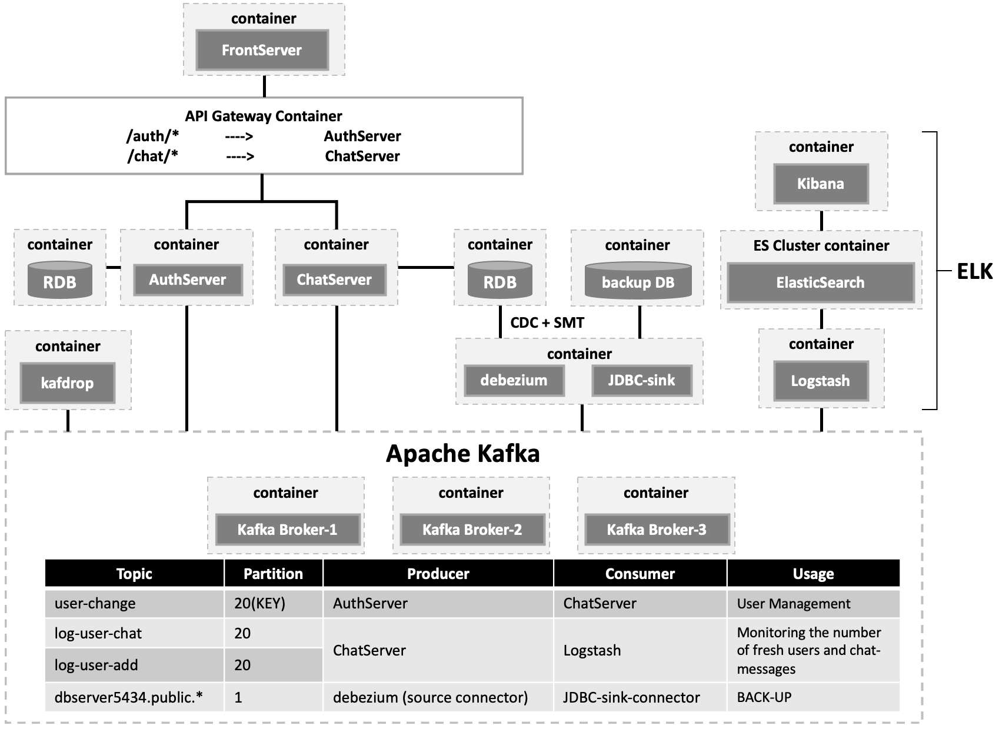

# Spring Java 채팅서버구현
## Versions

| Version                                                                     | Last Update | Skills                                                                                                                           | 
|-----------------------------------------------------------------------------|-------------|----------------------------------------------------------------------------------------------------------------------------------|
| **[v1](https://github.com/ghkdqhrbals/spring-chatting-server/tree/v1)**     | 2022.12.14  | WebSocket, Kafka, Spring-Data-Jpa, Thymeleaf, Interceptor, etc.                                                                  |
| **[v2](https://github.com/ghkdqhrbals/spring-chatting-server/tree/v2)**     | 2023.01.03  | ElasticSearch, Logstash, Kibana, WebSocket, Kafka, Spring-Data-Jpa, Thymeleaf, Interceptor, etc.                                 |
| **[v3](https://github.com/ghkdqhrbals/spring-chatting-server/tree/v3.1.1)** | 2023.01.14  | Test, Kafka-connector, ElasticSearch, Logstash, Kibana, WebSocket, Kafka, Spring-Data-Jpa, Thymeleaf, Interceptor, etc.          |
| **[v4](https://github.com/ghkdqhrbals/spring-chatting-server/tree/v4.0.0)** | 2023.01.24  | WebFlux, Test, Kafka-connector, ElasticSearch, Logstash, Kibana, WebSocket, Kafka, Spring-Data-Jpa, Thymeleaf, Interceptor, etc. |


# INDEX
1. [Current Architecture(v4)](#Current Architecture(v4))
2. Running with Docker
   * Backend Server
   * ELK
3. Update Logs

## Current Architecture(v4)


## Running with Docker
### Backend
1. Run `./gradlew build` in each directory(spring-auth-backend-server, spring-chatting-backend-server)
2. In root directory, run `docker-compose -f docker-compose.yaml up -d`
3. Run `sh ./install-jdbc-connector.sh` for installing jdbc-sink connector and copy to kafka-connector container(container will be restarted)
4. Send HTTP request to kafka-connector as below for configuring schema in source/sink connector
    * Source Connector
    
    ```
    {
        "name": "source-connector",
        "config": {
            "connector.class": "io.debezium.connector.postgresql.PostgresConnector",
            "plugin.name": "pgoutput",
            "database.hostname": "chatting-db-2",
            "database.port": "5434",
            "database.user": "postgres",
            "database.password": "password",
            "database.dbname" : "chat2",
            "database.server.name": "dbserver5434",
            
            "transforms": "unwrap,addTopicPrefix",
            "transforms.unwrap.type": "io.debezium.transforms.ExtractNewRecordState",
            "transforms.addTopicPrefix.type":"org.apache.kafka.connect.transforms.RegexRouter",
            "transforms.addTopicPrefix.regex":"(.*)",
            "transforms.addTopicPrefix.replacement":"$1"
        }
    }   
    ```

    * Sink Connector
    
    ```
    {
        "name": "sink-connector",
        "config": {
            "connector.class": "io.confluent.connect.jdbc.JdbcSinkConnector",
            "task.max" : 5,
            "topics": "dbserver5434.public.user_table,dbserver5434.public.friend,dbserver5434.public.room,dbserver5434.public.participant,dbserver5434.public.chatting",
            
            "connection.url": "jdbc:postgresql://chatting-db-1:5433/chat1",
            "connection.user":"postgres",
            "connection.password":"password",
            "insert.mode": "upsert",
            "pk.mode": "record_key",
            "tombstones.on.delete": "true",
    
            "key.converter": "org.apache.kafka.connect.json.JsonConverter",
            "key.converter.schemas.enable": "true",
            "value.converter": "org.apache.kafka.connect.json.JsonConverter",
            "value.converter.schemas.enable": "true",
            "transforms": "unwrap,dropPrefix",
            "transforms.unwrap.type": "io.debezium.transforms.ExtractNewRecordState",
            "auto.create": "true",
            "auto.evolve":"true",
            "transforms.dropPrefix.type":"org.apache.kafka.connect.transforms.RegexRouter",
            "transforms.dropPrefix.regex":"dbserver5434(.*)$",
            "transforms.dropPrefix.replacement":"$1",
    
            "batch.size": "1"
        }
    }   
    ```

5. Send HTTP reqeust to chatServer
    > example
    > 
    > ```
    > POST http://localhost:8080/chat/user
    > {
    >    "userId":"Hwangbo",
    >    "userName":"황보규민"
    > }
    > ```

6. See Results in Kafdrop [http://localhost:9000/](http://localhost:9000/)

### ELK stack
1. Please cloning [docker-elk](https://github.com/deviantony/docker-elk) for running elk stacks
2. Edit `/docker-elk/logstash/pipeline/logstash.conf` with following configurations
    
   ```
    input {
        kafka {
            type => "analysis1"
            bootstrap_servers => "kafka1:9092,kafka2:9092,kafka3:9092"
            group_id => "logstash-user-add"
            topics => "log-user-add"
            codec => "json"
            consumer_threads => 2
        }
    
        kafka {
            type => "analysis2"
            bootstrap_servers => "kafka1:9092,kafka2:9092,kafka3:9092"
            group_id => "logstash-chat"
            topics => "log-user-chat"
            codec => "json"
            consumer_threads => 3
        }
    }
    
    output {
        if [type] == "analysis1" {
            elasticsearch {
                hosts => "elasticsearch:9200"
                index => "new-user"
                workers => 1
                user => "elastic"
                password => "${LOGSTASH_INTERNAL_PASSWORD}"
            }
        }
        if [type] == "analysis2" {
            elasticsearch {
                hosts => "elasticsearch:9200"
                index => "chat"
                workers => 1
                user => "elastic"
                password => "${LOGSTASH_INTERNAL_PASSWORD}"
            }
        }
    }
    ```
   
3. Run `docker-compose -f docker-elk/docker-compose-es.yml up -d` in root directory
4. In Kibana[http://localhost:5601](http://localhost:5601), create index of new-user and chat

## Update Logs

### Update[v4.0.0]
* Add WebFlux for communicating backend by sending HTTP request through backend-api-gateway
  * Complete List
    * login
    * register
    * home
    * add friend
    
* Edit Scene with css files(But still, more process remain)
  * loginForm.html
  * addUserForm.html
  * addFriendForm.html
  * users.html

* Bug fix
  * infinite recursion in getting response with myFriendList
    * by adding ResponseGetFriend class for intermediate class(dto).

### Update[v3.1.1]
* Add more mock test and error-code

### Update[v3.1.0]
* Bug fix
  * Nginx Proxy Issue [Solved Issue #5](https://github.com/ghkdqhrbals/spring-chatting-server/issues/5)
  * Null ID exception [Solved Issue #7](https://github.com/ghkdqhrbals/spring-chatting-server/issues/7)
* Add configurations for sink multiple topics with Kafka connector
  * Source Connector
  * Sink Connector

### Update[v3.0.1]
* Bug fix : add logstash configuration and compose file name

### Update[v3.0.0]
1. Add Kafdrop for simple visualization
2. Update **Uni-directional DB sync** with kafka connector
   * Configure Source Connector with Debezium
   * Configure Sink Connector with JDBC-Sink-Connector that load from Confluent

### Update[v2.0.0]
* Visualized Kafka Traffics and others
  * Kibana
    
  * UI for Kafka
    
    
* 모노서버 분리
   * 유저인증서버 + 채팅서버
* Kafka 멀티 브로커 설정
* ElasticSearch 연동
* Logstash input filter 설정
* Kibana 연동 및 시각화 설정
* Docker container화

### Update[v1.1.1]
* Kafka 추가
   * localhost:9092 Broker 설정
   * Producer/Consumer 설정
   * Spring - Kafka 연동
* Make Sequence Diagram

### Update[v1.1.0]
* 채팅방 STOMP-WebSocket 실시간 양방향 통신 추가 
> 1. `유저A`는 채팅방 입장 시, 서버의 /stomp/chat 엔드포인트와 연결
> 2. 채팅 전송 시, /pub/chat/message 로 ChatMessageDTO와 함께 전송
> 3. 서버는 MessageHandler을 통해 SimpleBroker의 TOPIC : /sub/chat/message로 전달
> 4. SimpleBroker은 현재 연결된 유저 중, 해당 토픽을 구독하고 있는 `유저B`, `유저C` 에게 전달
> 5. `유저B`, `유저C`는 Jquery로 ChatMessageDTO의 메세지 파싱 후 읽음
 
### Update[v1.0.0]
* 기본적인 JPA 설정(Repository 생성)-PostgresDB 연동
   * 사용자, 채팅방, 채팅참여자, 친구를 저장할 수 있는 Repository 생성
* UserService 생성
   * UserRepository, FriendRepository, RoomRepository, ParticipantRepoisotry들을 Transactional 하게 관리하도록 설정

* UserController 생성
   * 여러가지 DTO 생성 + Thymeleaf 연동
* Login Filter 추가
   * 클라이언트 쿠키에 인증정보추가
* Form Error Handling
  * 공통처리
    * null값 입력
    * 입력값 가운데 space
  * **loginForm**
    * 일치하지 않는 ID/PW
  * **addFriendForm**
    * 존재하지 않는 유저를 친구추가
  * **addUserForm**
    * Email 형식 불일치
    * 존재하는 ID
