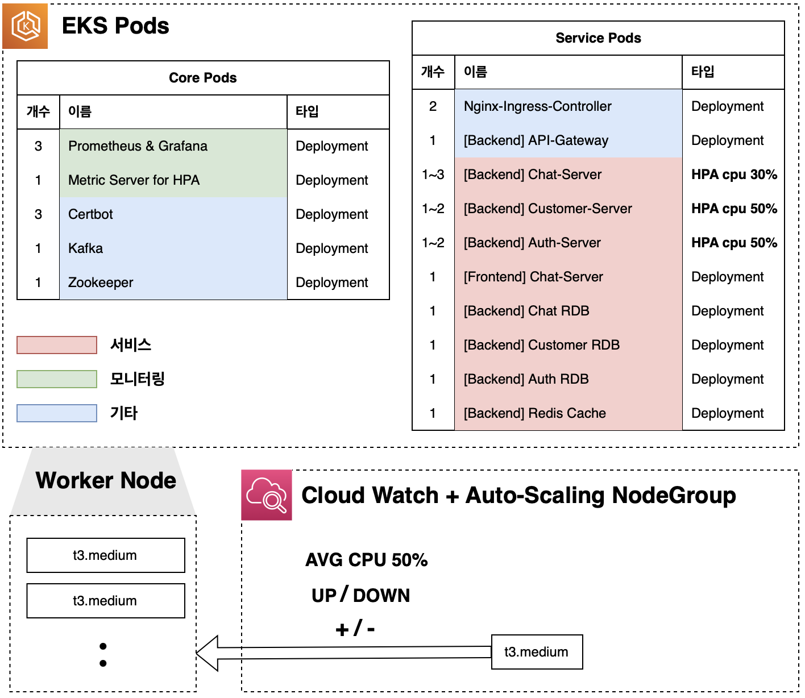
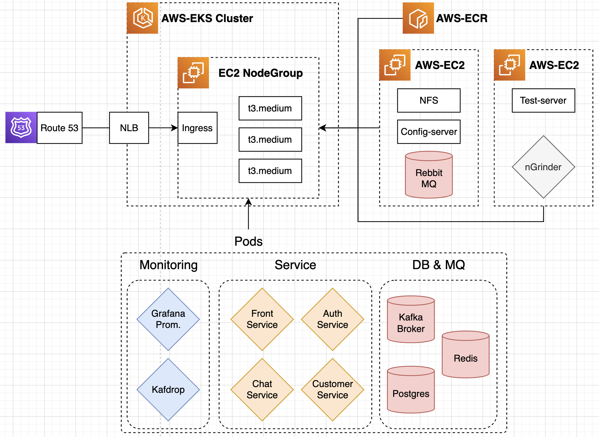
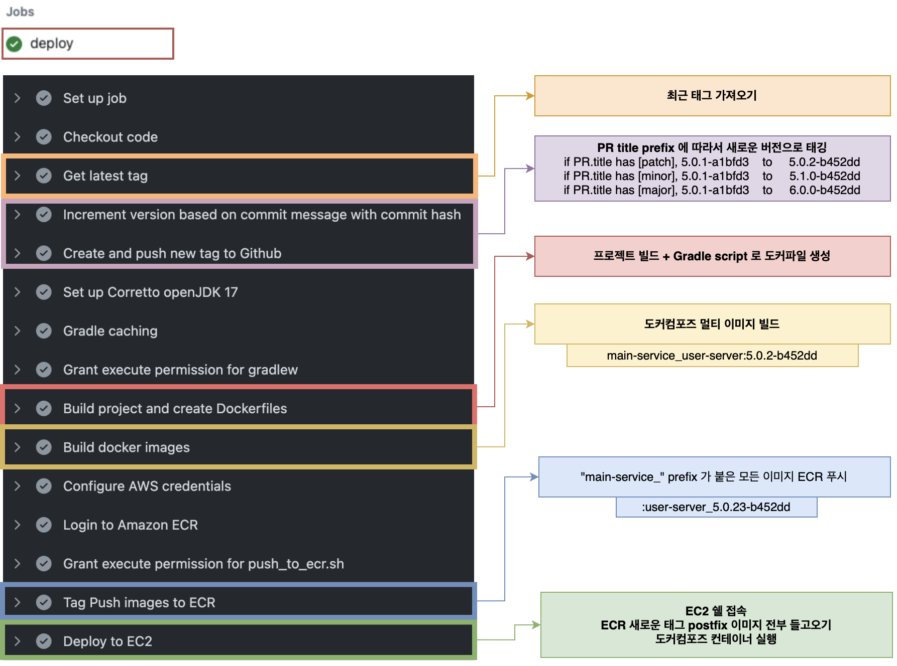
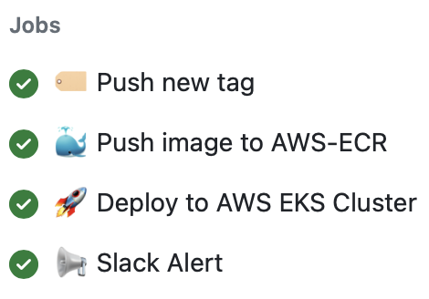
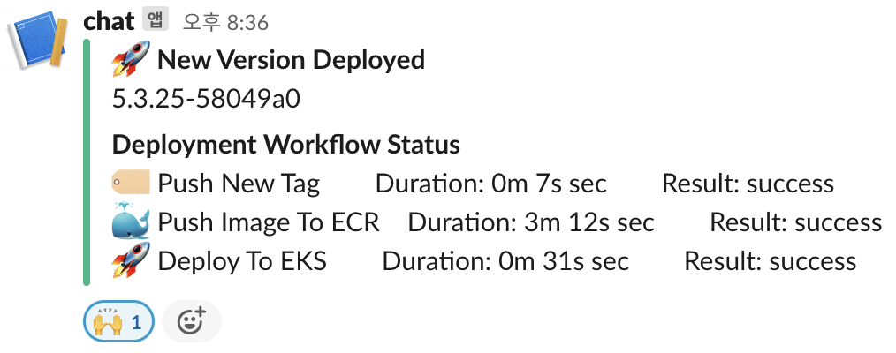

본 [프로젝트](https://github.com/users/ghkdqhrbals/projects/3)는 다양한 기술을 실험적으로 적용하는 것을 목적으로 합니다. 프로젝트의 진행과정을 알고싶으신 분은 [블로그](https://ghkdqhrbals.github.io/portfolios/docs/project/) 를 참고해주세요. 저는 자동화와 성능향상에 초점을 맞추고 개발하고 있습니다.

5.2.0 부터는 EKS 마이그레이션이 완료되었습니다 [https://www.litcodev.com](https://www.litcodev.com). 로컬에서 수행하기 위해서는 [4.2.0v](https://github.com/ghkdqhrbals/spring-chatting-server/tree/v4.2.0) 버전으로 태그를 이동하고 Instruction 에 따라 실행해주세요(based on [correto-jdk-17](https://docs.aws.amazon.com/corretto/latest/corretto-17-ug/downloads-list.html)).

현재는 추가 개발을 멈추고 서버 로드테스트를 진행하고 있습니다. 로드 테스트 툴은 [nGrinder](https://naver.github.io/ngrinder) 와 Golang 으로 직접만든 [Gotybench](https://github.com/ghkdqhrbals/gotybench) 을 사용하고 있습니다. 테스트 및 성능향상 기록은 Issue 에 [feature:performance](https://github.com/ghkdqhrbals/spring-chatting-server/issues?q=is%3Aopen+is%3Aissue+label%3A%22feature%3A+performance%22) 태그로 기록 중입니다.

| Pod 종류와 Scale-up/down | 전체 아키텍처 | 
|--|--|
|  |  |

| (기존) 모노서버 배포 자동화 | (최근) AWS-EKS 배포 자동화 | 
|--|--|
|  |   |

> Backend & Frontend Contributor 를 모집중입니다. 자유롭게 신청하세요 :) 학생이나 직장인 모두 재미삼아 참여하실 수 있어요!
>
> We are looking for contributors in any fields. Feel free to apply :) Both students and who work at a company can join this project for fun!

## Update Logs
### v5.x.x
#### PR
* PR(MultipleImplementations) https://github.com/ghkdqhrbals/spring-chatting-server/pull/146
* PR(ExceptionECR) https://github.com/ghkdqhrbals/spring-chatting-server/pull/106
* PR(ExceptionECR) https://github.com/ghkdqhrbals/spring-chatting-server/pull/104
* PR(AutoECRPushScript) https://github.com/ghkdqhrbals/spring-chatting-server/pull/101
* PR(CI/CD pipelining) https://github.com/ghkdqhrbals/spring-chatting-server/pull/100
* PR(LackResource) https://github.com/ghkdqhrbals/spring-chatting-server/pull/99
* PR(TestPipelining) https://github.com/ghkdqhrbals/spring-chatting-server/pull/96
* PR(AutoGradleScript) https://github.com/ghkdqhrbals/spring-chatting-server/pull/68
#### Main Issues
* Issue(RefreshToken) https://github.com/ghkdqhrbals/spring-chatting-server/issues/135
* Issue(CI/CD Pipelining) https://github.com/ghkdqhrbals/spring-chatting-server/issues/78
* Issue(CI/CD Pipelining) https://github.com/ghkdqhrbals/spring-chatting-server/issues/116
* Issue(LackResource) https://github.com/ghkdqhrbals/spring-chatting-server/issues/113
* Issue(KafkaIdempotency) https://github.com/ghkdqhrbals/spring-chatting-server/issues/62
* Issue(SinkFluxManaging) https://github.com/ghkdqhrbals/spring-chatting-server/issues/59
* Issue(FrontServer) https://github.com/ghkdqhrbals/spring-chatting-server/issues/46
* Issue(DockerUtilScript) https://github.com/ghkdqhrbals/spring-chatting-server/issues/45
* Issue(KafkaConsumer) https://github.com/ghkdqhrbals/spring-chatting-server/issues/17
* Issue(SpringBeanOverriding) https://github.com/ghkdqhrbals/spring-chatting-server/issues/24
* Issue(K8S) https://github.com/ghkdqhrbals/spring-chatting-server/issues/115
* Issue(awsECR) https://github.com/ghkdqhrbals/spring-chatting-server/issues/111
* Issue https://github.com/ghkdqhrbals/spring-chatting-server/issues/281

### v4.2.1

* Fix performance issue(Insert 10K chatting required time **80 sec** -> **29 sec**)
  * Update list
    * batch
      * before : 1
      * after : 100
    * chatting_id generation algorithm
      * before : from db sequence
      * after : random.UUID
    * add db parallel processor
      * before : 1
      * after : 8
    * reduce query frequency per addChatRequest
      * before : 6
      * after : 4
    * add chatServer
      * before : 1
      * after : 2
> Before : ( get response ) **125. / sec**
>

> After : ( get response ) **344. / sec**
>

### v4.2.0
* Add WebFlux
  * chatting
* Add Kibana Graph
  * new-user traffic
  * chat traffic

### v4.1.0
* Add WebFlux(To see more details about what is remaining, [visit blog](https://ghkdqhrbals.github.io/posts/chatting(16)))
  * Complete List
    * logout(non-blocking)
    * change user status
    * add/get user chat room list
* Add getUser api in ChatServer
* Edit userService.makeRoomWithFriends where setting room name

### v4.0.1
* Bug fix
  * 4xx response when send logout [Solved Issue #13](https://github.com/ghkdqhrbals/spring-chatting-server/issues/13)

### v4.0.0
* Add WebFlux for communicating backend by sending HTTP request through backend-api-gateway
  * Complete List
    * login
    * register
    * home
    * add friend

* Edit HTML and CSS files(But still, more process remain)
  * loginForm.html
  * addUserForm.html
  * addFriendForm.html
  * users.html

* Bug fix
  * infinite recursion in json response [Solved Issue #12](https://github.com/ghkdqhrbals/spring-chatting-server/issues/12)
    * by adding ResponseGetFriend class for intermediate class(dto)

* Change backend-gateway config
  * port `8080` -> `8060`
  * listen ip `localhost` -> `127.0.0.1`

### v3.1.1
* Add more mock test and error-code

### v3.1.0
* Bug fix
  * Nginx Proxy Issue [Solved Issue #5](https://github.com/ghkdqhrbals/spring-chatting-server/issues/5)
  * Null ID exception [Solved Issue #7](https://github.com/ghkdqhrbals/spring-chatting-server/issues/7)
* Add configurations for sink multiple topics with Kafka connector
  * Source Connector
  * Sink Connector

### v3.0.1
* Bug fix : add logstash configuration and compose file name

### v3.0.0
1. Add Kafdrop for simple visualization
2. Update **Uni-directional DB sync** with kafka connector
  * Configure Source Connector with Debezium
  * Configure Sink Connector with JDBC-Sink-Connector that load from Confluent

### v2.0.0
* Visualized Kafka Traffics and others
  * Kibana
  * UI for Kafka
* 모노서버 분리
  * 유저인증서버 + 채팅서버
* Kafka 멀티 브로커 설정
* ElasticSearch 연동
* Logstash input filter 설정
* Kibana 연동 및 시각화 설정
* Docker container화

### v1.1.1
* Kafka 추가
  * localhost:9092 Broker 설정
  * Producer/Consumer 설정
  * Spring - Kafka 연동
* Make Sequence Diagram

### v1.1.0
* 채팅방 STOMP-WebSocket 실시간 양방향 통신 추가

### v1.0.0
* 기본적인 JPA 설정(Repository 생성)-PostgresDB 연동
  * 사용자, 채팅방, 채팅참여자, 친구를 저장할 수 있는 Repository 생성
* UserService 생성
  * UserRepository, FriendRepository, RoomRepository, ParticipantRepoisotry들을 Transactional 하게 관리하도록 설정

* UserController 생성
  * 여러가지 DTO 생성 + Thymeleaf 연동
* Login Filter 추가
  * 클라이언트 쿠키에 인증정보추가
* Form Error Handling
  * 공통처리
    * null값 입력
    * 입력값 가운데 space
  * **loginForm**
    * 일치하지 않는 ID/PW
  * **addFriendForm**
    * 존재하지 않는 유저를 친구추가
  * **addUserForm**
    * Email 형식 불일치
    * 존재하는 ID
